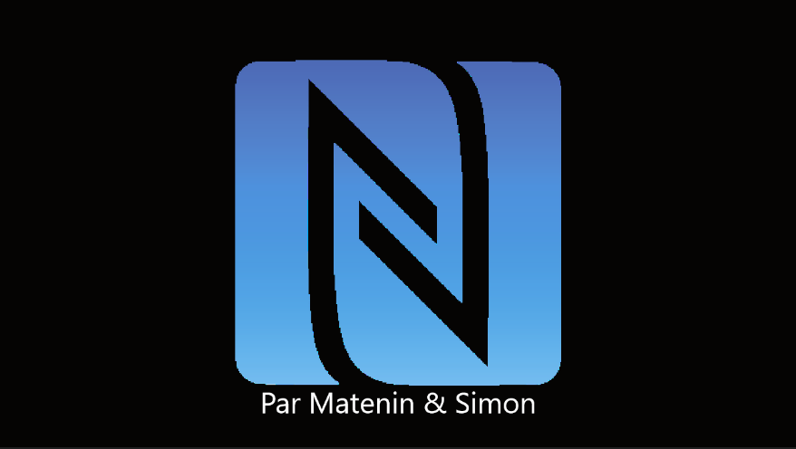
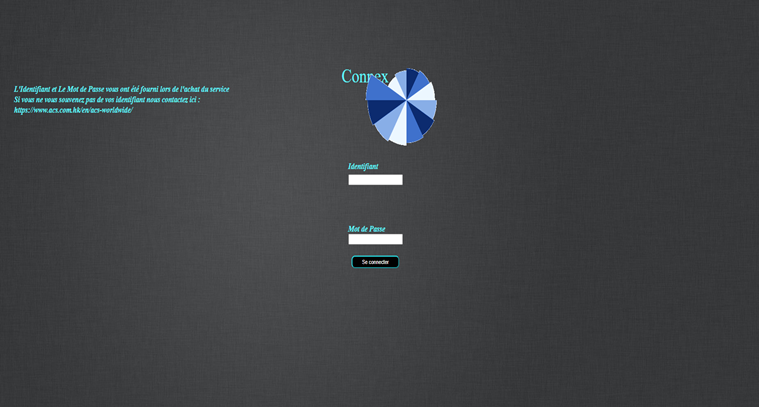
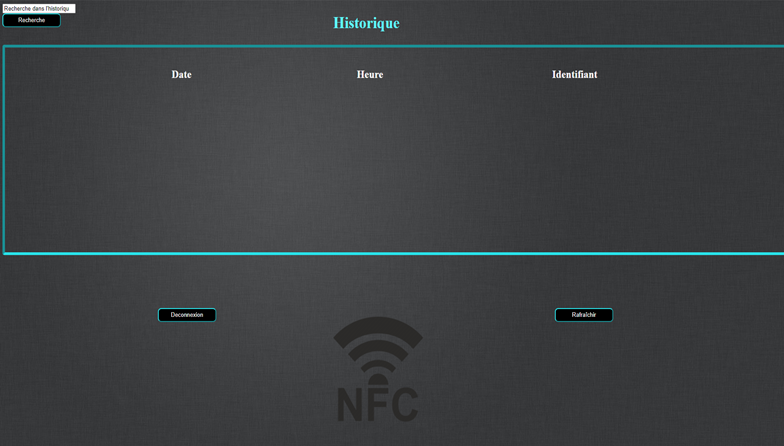

# NFC Historique

# Le rôle du NFC Historique

Le NFC Historique permet de récupérer les informations qui transitent sur le NFC et d'en faire un historique sur une interface web.

# Identifiant 

Pour accéder à l'interface web

identifiant : Vallette

mot de passe : Vallette

# Interface Web

Page de connexion 

Page de l'Historique

